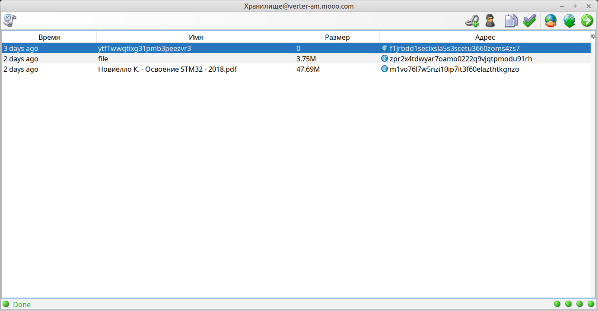

= Easy remote file storage (ezRFS)

Extremely simple remote file storage.

It is used for short-term storage of a file in a weak cloud VPS and accessible from the Internet.

== Modules

=== LFS

Local File Storage

- There is no database, everything is stored in the file system

=== ezRFS

Remote File Storage over LFS

- 2 operations: POST and GET

- GET without authorization

- POST Basic Authorization + lock aware

- GraalVM native aware

- JRE 21

- files are automatically deleted by cron via linux find & rm

=== ezRFS-Tray

Java Swing tray application for manage uploaded files

- add url

- copy url

- check url

- clipboard listener

- upload file

- download file

- JRE 21

- Jpackage installer

=== external tools

bash, 7z, comm, jpackage,  find

